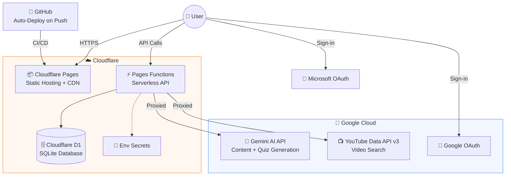

# Course Creator

An open-source educational app that turns any topic into a structured learning course — with curated YouTube videos, AI-generated notes & quizzes, 1v1 battles, and study duo mode.

🌐 **Live:** [coursecreator.mkarjun.com](https://coursecreator.mkarjun.com)


## ✨ Features

- **📚 Structured Courses** — Enter any topic → 4 lessons progressing from fundamentals to advanced
- **📺 Curated Videos** — Best YouTube videos auto-selected for each lesson
- **📝 AI Notes & Roadmap** — Study guide with phases, key concepts, and practice exercises
- **❓ Quizzes** — AI-generated factual quizzes to test your knowledge
- **⚔️ 1v1 Battles** — Challenge a friend, both take the same quiz, compare scores
- **👥 Study Duo** — Invite a buddy to learn the same course together, auto-battle at the end
- **🌐 Community Links** — Auto-curated Reddit, Discord, and forum links per topic
- **🏆 Badges & Streaks** — Gamified progress tracking
- **🔐 Auth** — Google, Microsoft, or Guest mode
- **🌙 Dark/Light Mode** — Responsive on all devices

## 🏗️ Architecture



> **Demo Mode:** If API quotas are exhausted, the app falls back to placeholder videos and generic quizzes. It always loads — features degrade gracefully.

## 📁 Project Structure

```
coursecreator/
├── index.html                    # Main SPA
├── css/styles.css                # All styles
├── js/
│   ├── app.js                    # Entry point
│   ├── auth.js                   # Google/Microsoft/Guest auth
│   ├── config.js                 # Prompts, badges, settings
│   ├── api-service.js            # API calls + demo fallbacks
│   ├── course-generator.js       # Course creation orchestrator
│   ├── topic-intelligence.js     # Offline topic classification
│   ├── ui.js                     # UI rendering
│   ├── storage.js                # LocalStorage + D1 sync
│   ├── database-service.js       # D1 database operations
│   ├── battle.js                 # 1v1 challenge system
│   └── duo.js                    # Study duo mode
├── functions/
│   ├── api/                      # API route handlers (thin layer)
│   │   ├── generate.js           # POST /api/generate
│   │   ├── youtube.js            # GET  /api/youtube
│   │   ├── courses.js            # POST /api/courses
│   │   ├── users.js              # POST /api/users
│   │   ├── battle.js             # POST /api/battle
│   │   ├── duo.js                # POST /api/duo
│   │   ├── config.js             # GET  /api/config
│   │   └── cleanup.js            # GET  /api/cleanup + Cron
│   ├── _services/                # Business logic
│   ├── _repositories/            # Data access (D1 queries)
│   └── _shared/                  # Middleware, utils, validators
├── schema.sql                    # D1 database schema
├── wrangler.jsonc                # Cloudflare config
├── _headers                      # Cache control rules
├── robots.txt                    # SEO
└── sitemap.xml                   # SEO
```

## 🚀 Getting Started

### Try It
Visit [coursecreator.mkarjun.com](https://coursecreator.mkarjun.com) — no setup needed.

### Local Development
```bash
# Clone
git clone https://github.com/mkarjun/coursecreator.git
cd coursecreator

# Create js/env.js with your keys (see js/env.template.js)

# Run locally with Wrangler (includes D1 + Functions)
npx wrangler pages dev ./

# Or just open index.html for demo mode
```

## 🔑 API Keys

| Key | Provider | Purpose |
|-----|----------|---------|
| `GEMINI_API_KEY` | [Google AI Studio](https://aistudio.google.com/) | Course content + quiz generation |
| `YOUTUBE_API_KEY` | [Google Cloud Console](https://console.cloud.google.com/) | YouTube video search |
| `GOOGLE_CLIENT_ID` | Google Cloud Console | Google OAuth sign-in |
| `MICROSOFT_CLIENT_ID` | [Azure Portal](https://portal.azure.com/) | Microsoft OAuth sign-in |

## 🏅 Badges

| Badge | Name | Requirement |
|-------|------|-------------|
| 🚀 | First Steps | Complete 1 course |
| 📚 | Knowledge Seeker | Complete 5 courses |
| 🎓 | Scholar | Complete 10 courses |
| ⭐ | Quiz Master | 100% on a quiz |
| 👑 | Perfectionist | 100% on 5 quizzes |
| 🔥 | Consistent Learner | 3-day streak |
| 🔥 | Week Warrior | 7-day streak |
| ▶️ | Video Marathon | Watch 50 videos |

## 🤝 Contributing

This is an open-source project and contributions are welcome!

- 🐛 Report bugs via [Issues](https://github.com/mkarjun/coursecreator/issues)
- 💡 Suggest features
- 🔧 Submit pull requests

## ☕ Support

If you find this useful, consider [buying me a coffee](https://buymeacoffee.com/) to help cover API and infrastructure costs.

## 📝 License

MIT License — free to use and modify.

---

Made with ❤️ for learners everywhere
